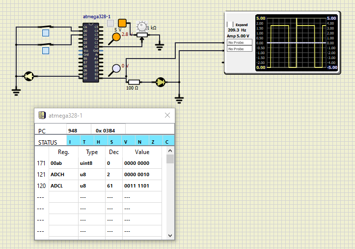

## Activity 1
|When both the switches are OFF|When both the switches are ON|
|---------------------|---------------------|
|||

## Activity 2
|ADC both inputs are OFF|ADC both inputs are ON|
|-----------------------|----------------------|
|||
## Activity 3
|PWM OFF|PWM ON|
|-----------------------|----------------------|
|||
## Activity 4
|Output Temperature at 29 degrees|
|Serial OFF|Serial ON|
|-----------------------|----------------------|
|||
